# Тема

Методы искусственного интеллекта. EDA. Линейная регрессия. Дерево решений. CatBoost. XGBoost. Нейронные сети (MLP).

# Цель работы

Целю данной работы заключается в получении навыков анализа первичных данных и определение признаков взаимосвязи (EDA), понимания моделей: линейная регрессия, дерево решений, CatBoost, XGBoost, нейронные сети (MLP) и умения разрабатывать программу на языке Python для реализации представленных моделей.

# Задание
## Основные пункты к исполнению

1) Описать датасета и определить влияние признаков и выбрать признаки, которые наиболее подходят для поставленной задачи предсказания (EDA).
2) Построить пайплйан (DVC) исходя из результатов EDA.
3) Реализовать линейную регрессию, определить весовые коэффициенты, метрики и ошибки.
4) Реализовать дерево решений, определить метрики и ошибки. Привести рисунок первых узлов дерева решений.
5) Реализовать CatBoost, определить метрики и ошибки. Выгрузить Feature Importance.
6) Реализовать XGBoost, определить метрики и ошибки. Выгрузить Feature Importance.
7) Реализовать нейронную сеть, определить метрики, ошибки, кривые обучения, гистограммы весов с интерпретацией и график из Tensorboard.
8) Выгрузить конечный вычислительный граф DVC.
9) Построить сводную таблицу с метриками и сделать вывод какая модель отработала лучше и почему.
10) Сделать вывод по работе.

## Анализ данных
После проведенного анализа данных должно быть понятно:
1) Какие признаки будут использованы для предсказания и почему?
2) Как будут преобразованы выбранные признаки и почему?
3) Оценить значимость каждого признака?
В конце EDA должен быть полный и исчерпывающий вывод о том, какие данные и как будет решаться поставленная задача.

# Описание датасета

## Контекст

Этот набор данных содержит информацию о величине медицинских расходов страховых контрагентов

## insurance.csv

- возраст: возраст основного выгодоприобретателя
- пол: пол страхового контрагента, женщина, мужчина
- bmi: индекс массы тела, обеспечивающий понимание тела, веса, который является относительно высоким или низким по отношению к росту, объективный показатель массы тела (кг / м ^ 2), использующий отношение роста к весу, в идеале от 18,5 до 24,9
- дети: количество детей, охваченных медицинским страхованием / Количество иждивенцев
- курильщик: курение
- регион: район проживания бенефициара в США, северо-восток, юго-восток, юго-запад, северо-запад.
- расходы: индивидуальные медицинские расходы, выставленные медицинским страхованием

# Ход работы

## Разведочный анализ данных ([EDA](notebooks/EDA.ipynb))

Изначально после загрузки данных через `pandas` и вызова методов `describe` и `info` было выявлено, что
- В данных отсутствуют пустые строки.
- От выбросов данные чистить нельзя, ввиду того, что это реальные значения, а не показания сенсоров (которые часто имеют высокую степень зашумлённости).
- Необходимо привести текстовые столбцы к OneHot формат.
- Необходимо логарифмирование целевой переменной "charge", ввиду её высокой дисперсии.
- Столбец "кол-во детей" возможно привести к OneHot формату исходя из отношений (=0, [1, 2], >3).
- Остальные численные колонки выборки необходимо нормализовать.

При помощи функций из `sklearn.preprocessing`: `OneHotEncoder`, `LabelBinarizer`, `StandardScaler`, а также самописной функции `children_category` была произведена обработка данных.


- `sex(пол)`, `smoker(курильщик)` ввиду наличия только двух состояний были закодированы при помощи `LabelBinarizer`.
- `children(дети)`, был приведён к формату **(=0, [1, 2], >3) $\rightarrow$ (0, 1, 2)** при помощи `children_category` и вместе со столбцом `region` были приведены к **OneHot** формату при помощи `OneHotEncoder`
- `age`, `bmi`, для лучшей сходимости градиентов стандартизованы при помощи `StandardScaler`

При помощи метода `ProfileReport` из `ydata_profiling` был получен интерактивный отчёт в формате **HTML**, который включает в себя:

- Обзор структуры датасета: типы данных, количество пропусков, размерность.
- Детальную статистику по каждому признаку: распределение значений, квантили, гистограммы, выявление выбросов.
- Диаграммы взаимосвязей признаков, таких как - Матрица корреляции (для числовых признаков).

В процессе генерации отчёта автоматически строятся диаграммы, которые помогают визуально оценить структуру данных. Одной из наиболее информативных является тепловая карта корреляции. На ней отражены значения коэффициента корреляции Пирсона, показывающие силу и направление линейной связи между числовыми переменными.

Ниже представлен пример такой тепловой карты, полученной для подготовленного исследуемого датасета `insurance.csv`:

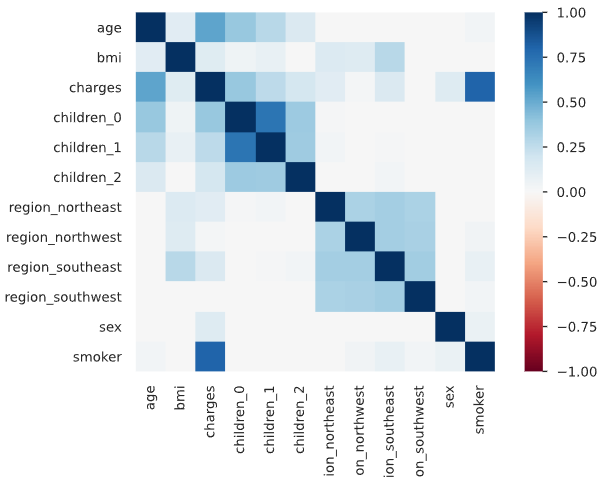

А также пример статистики по одному из признаков **(bmi)**

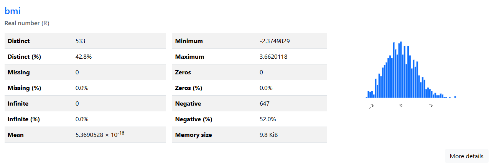


На представленном графике с `матрицей корреляции` можно наблюдать следующие ключевые моменты относительно целевая переменной `charges`:

- Видна её средняя положительная корреляция с возрастом (age) и количеством детей (children_{0, 1, 2}).
- Можно заметить, что с увеличением кол-ва детей уменьшается стоимость лечения.
- Также можно заметить, что имеется практически незаметная корреляция с районом проживания, что говорит о потенциальном хоть и незначительном изменении стоимости лечения в зависимости от района проживания. 

Учитывая бедность данного датасета в отношении количества признаков, доступных к исследованию, решено использовать все предоставленные.

---

### Резюме этапа EDA

***Изначальные признаки и проведённые преобразования:***

- **Категориальные признаки:**
    - sex, smoker → бинарное кодирование (LabelBinarizer)
    - region → one-hot кодирование (4 новых признака)

- **Числовые признаки:**
    - age, bmi → стандартизация (StandardScaler)
    - children → категоризация (0, [1,2], >2) с последующим one-hot кодированием
    - charges → логарифмирование (np.log1p) для снижения дисперсии

**Основные предпосылки для преобразований:**
- Отсутствие выбросов означает, что данные можно использовать без дополнительной очистки
- Категоризация children упрощает интерпретацию влияния количества детей на стоимость
- One-hot кодирование региона позволяет модели учитывать географические различия
- Стандартизация числовых признаков улучшит сходимость градиентных методов


- charges требует логарифмирования перед обучением ввиду высокой дисперсии, однако логарифмирование будет производиться непосредственно в [файлах для обучения моделей](src/models/)


> [!IMPORTANT]
> После ряда преобразований получен датасет с 12 признаками, который содержит:
> - 2 нормализованных числовых признака
> - 2 бинарных признака
> - 7 one-hot признаков (4 для региона, 3 для количества детей)
> - Логарифмированная целевая переменная *(логарифмируется перед обучением моделей)*

## Реализация программного кода и обучения моделей
### Формирование структуры проекта, git и DVC

Проект организован стандартным образом в соостветствии с использованием [DVC (Data Version Control)](https://dvc.org/), что облегчает навигацию:

- [config/](config/): Директория для конфигурационных файлов проекта.
- [data/](data/): Содержит исходные данные. Поддиректория raw/ хранит сам файл insurance.csv, версионируемый через **DVC**.
- [dvc_plots/](dvc_plots/): Визуализации и графики, сгенерированные в процессе экспериментов **DVC**.
- [notebooks/](notebooks/): Jupyter ноутбуки с разведочным анализом данных **EDA**.
- [src/](src/): Исходный код на Python, разбитый на модули ([для загрузки данных и подготовки признаков](src/data), [обучения каждой из моделей](src/models)) для осуществления пайплайна.
- [dvc.yaml](dvc.yaml) и [dvc.lock](dvc.lock): Файлы, определяющие пайплайн (этапы обработки и обучения) и фиксирующие его текущее состояние.
- [README.md](README.md): Текущий файл с описанием проекта (который Вы читаете).
- Остальные разделы, не входят в git по причине контроля версий при помощи **DVC**

### Инициализация и первый эксперимент

Для инициализации локального репозитория git и настройки DVC были выполнены следующие команды:

```bash
# 1. Инициализация Git-репозитория
git init
```

```bash
# 2. Инициализация DVC в проекте
dvc exp run
```

```bash
# 3. Добавление данных под контроль DVC (вместо Git)
dvc add data/raw
```

```bash
# 4. Настройка удаленного хранилища для DVC (например, локальная папка или облако)
dvc remote add -d storage dvc_storage
```

```bash
# 5. Фиксация изменений в Git (файлы .dvc и .gitignore)
git add .gitignore data/raw.dvc .dvc/config
git commit -m "..."
```

Далее для создания пайплайна подготовки данных и обучения на них моделей были созданы файлы [dvc.yaml](dvc.yaml) и [params.yaml](config/params.yaml), в которых находятся зависимости, этапы пайплайна и конфигурация моделей, данных соответственно.

```yaml
# Пример содержимого dvc.yaml
stages:

  preprocess:
    cmd: python src/data/make_dataset.py
    deps:
    - data/raw/insurance.csv
    - src/data/make_dataset.py
    params:
    - config/params.yaml:
      - base
      - data
    outs:
    - data/processed/train.csv
    - data/processed/test.csv
    - data/processed/data_x.npy
    - data/processed/data_y.npy
    - data/processed/insurance_processed.csv

  train_linear:
    cmd: python src/models/train_linear.py
    deps:
    - data/processed/train.csv
    - data/processed/test.csv
    - src/models/train_linear.py
    params:
    - config/params.yaml:
      - base
      - models.linear
    outs:
    - models/linear.pkl
    # - dvclive/linear/params.yaml
    - reports/figures/linear_coefficients.png
    - reports/linear_coefficients.json
    metrics:
    - dvclive/linear/metrics.json
    plots:
    - dvclive/linear/plots
  # ... аналогично для других моделей
```

После написания всех [скриптов для обучения моделей](src/models/) был проведён тестовый запуск

```bash
# 6. Запуск первого эксперимента по пайплайну, описанному в dvc.yaml
dvc repro
```

В ходе запуска проявились *очепятки*, которые в конечном итоге были исправлены и был запущен первый рабочий пайплайн.

### Проведение экспериментов и визуализация результатов

Далее при помощи расширения для среды разработки VScode были запущены эксперименты при различных комбинациях параметров для моделей, однако такие эксперименты можно было запустить при помощи командной строки, например:

```bash
# 7. Запуск эксперимента по пайплайну, c изменёнными параметрами
dvc exp run -S config/params.yaml:models.decision_tree.max_depth=15
```
В конечном итоге после проведения серии запусков при различных параметрах, были сохранены параметры с наилучшими значениями метрик для моделей.

- Для `DecisionTreeRegressor` построена диаграмма с первыми узлами дерева решений.

    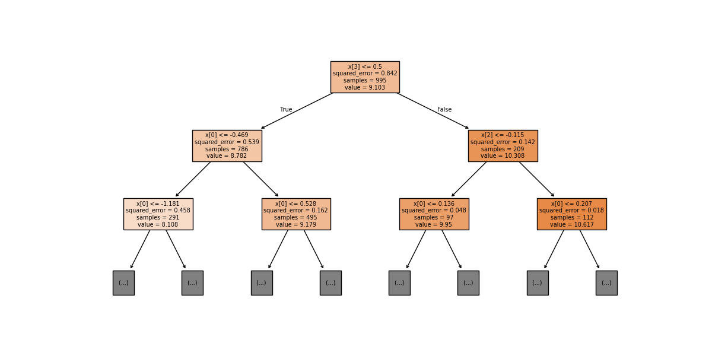

- Для `CatBoost`, `XGBoost` были визуализированы диаграммы влияния признаков (feature importances) на результирующую (выходную) составляющую данных.

    - `CatBoost features`

    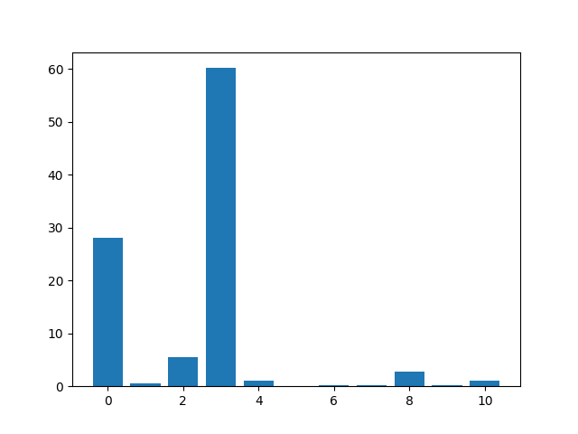

    - `XGBoost features`

    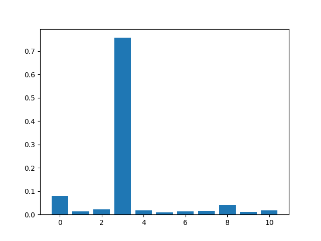

- Для `LinearRegression` была визуализированная диаграмма со значениями коэффициентов при каждом признаке.

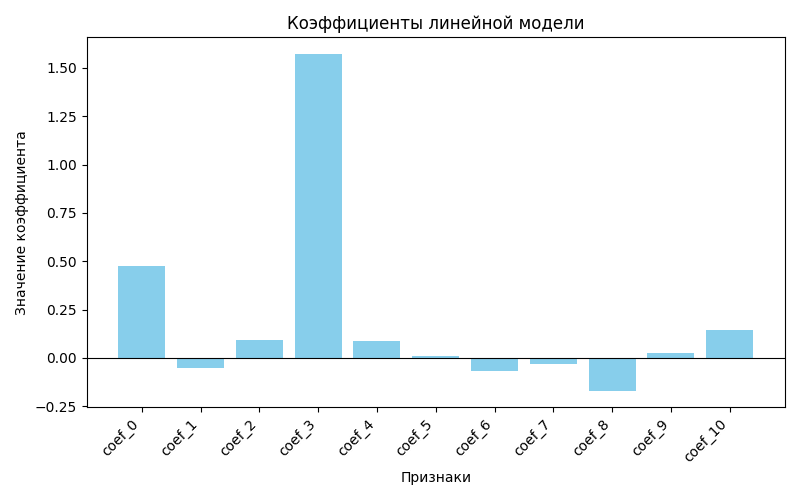

- А для `ANN` полносвязной нейронной сети были построены гистограммы распределений значений весовых коэффициентов, диаграмма изменения потерь, архитектура модели, а также произведено логирование дополнительных данных и графиков изменения метрик от эпох при помощи `tensorboard`.

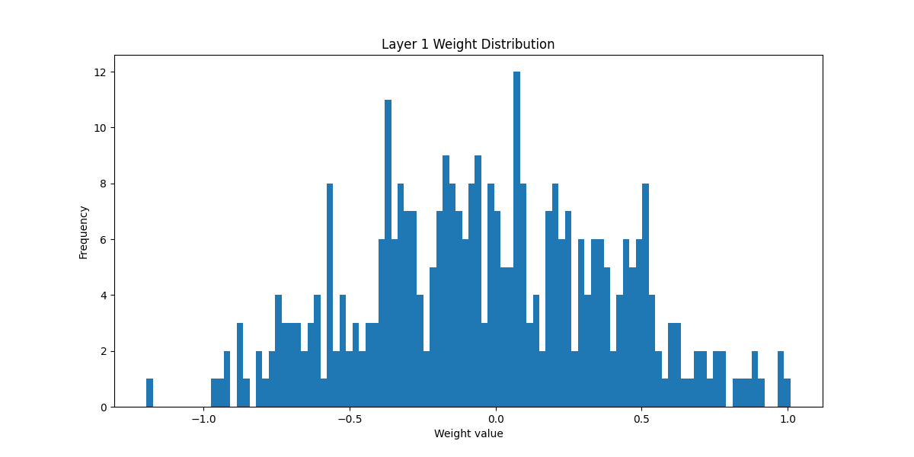
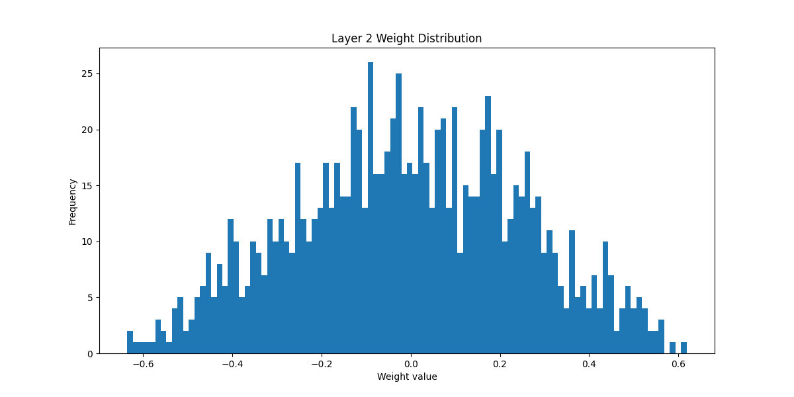
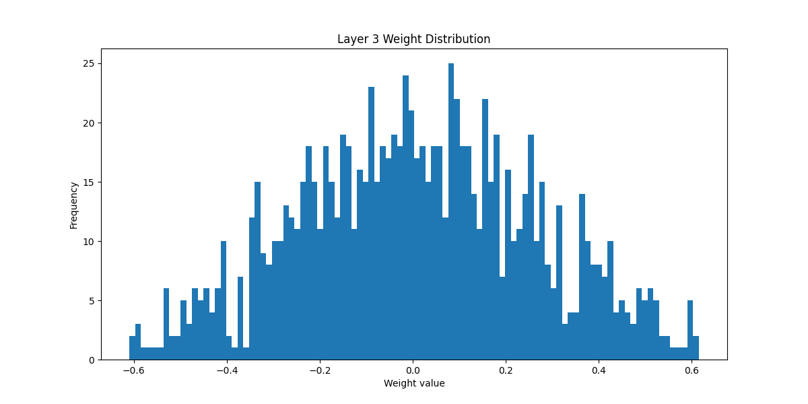
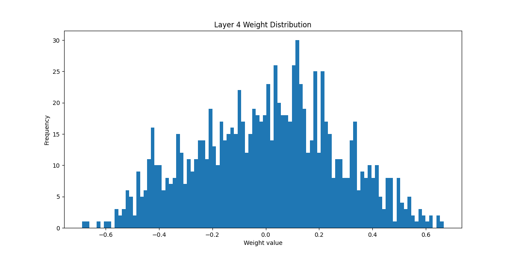
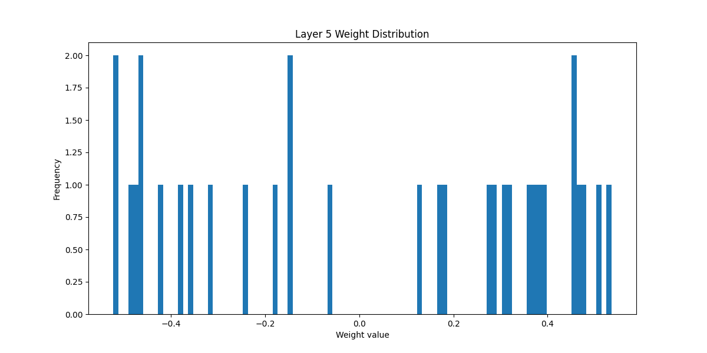
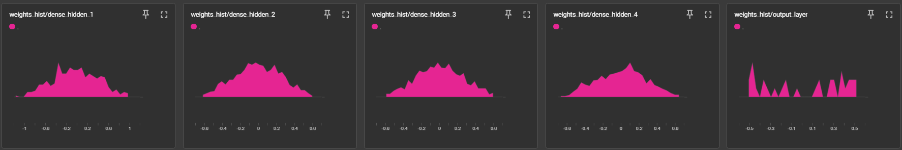

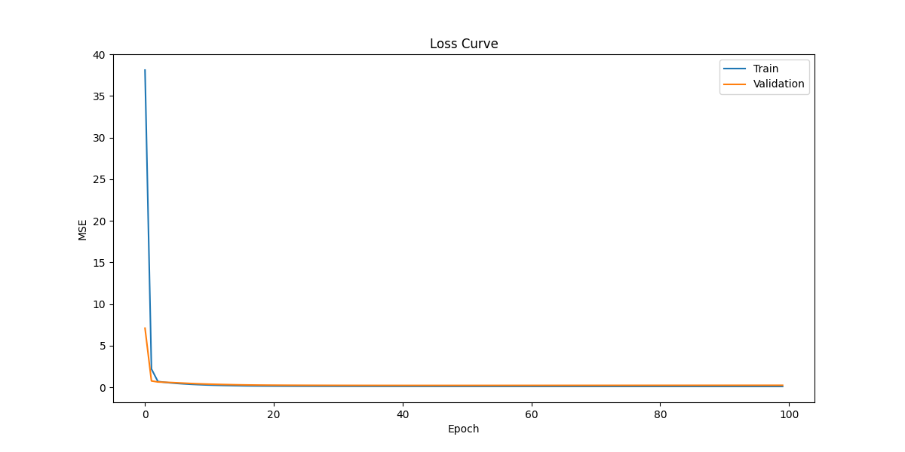

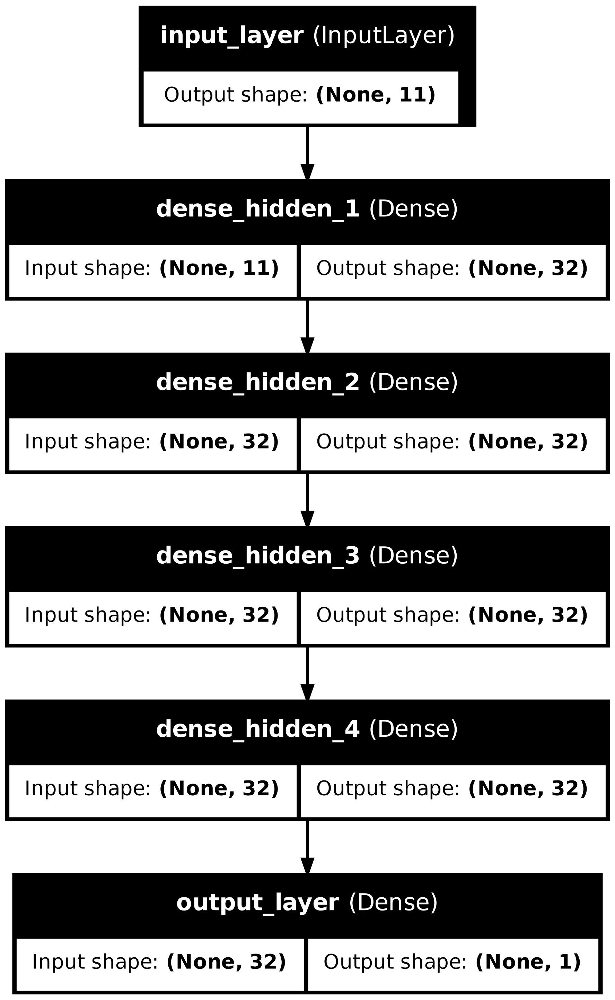

По результатам проведения экспериментов была сформирвана таблица с лучшими метриками при помощи команды:

```bash
# 8. Визуализация таблицы с метриками для каждой модели
dvc metrics show
```

Которая выглядит следующим образом:

```
Path                                test.mae    test.r2    test.rmse
dvclive/linear/metrics.json         4115.61572  0.50105    8182.21194
dvclive/decision_tree/metrics.json  2835.42667  0.76362    5631.80838
dvclive/catboost/metrics.json       2503.28591  0.79503    5244.3607
dvclive/xgboost/metrics.json        2521.39948  0.79492    5245.65581
dvclive/ann/metrics.json            2792.78227  0.77664    5474.55504
```

Исходя из полученных значений метрик - лучшей моделью стала catboost в контексте данной задачи.


### Резюме этапа реализации программного кода и обучения моделей

> [!IMPORTANT]
> Создан DVC-пайплайн для воспроизводимого ML:
> Стадии: preprocess + обучение 5 моделей (train_linear, train_tree, train_catboost, train_xgboost, train_ann)
> Параметры: централизованное хранение в params.yaml
> Эксперименты: запуск с перебором гиперпараметров через dvc exp run -S
>
> Лучшая модель: CatBoost (минимальные ошибки MAE/RMSE)
> Ключевой признак: smoker (доминирует во всех моделях)
> Закономерности:
> Градиентный бустинг > Нейросеть > Дерево > Линейная регрессия
> Нелинейные модели значительно точнее линейной
> Результат: Все пункты задания выполнены, получены требуемые визуализации