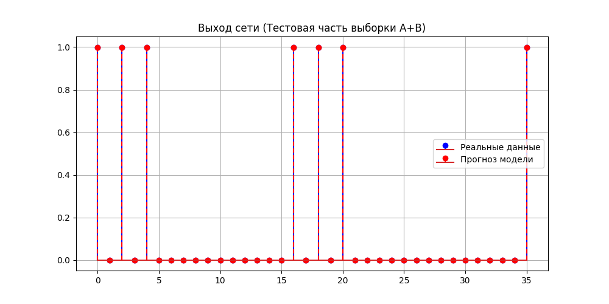
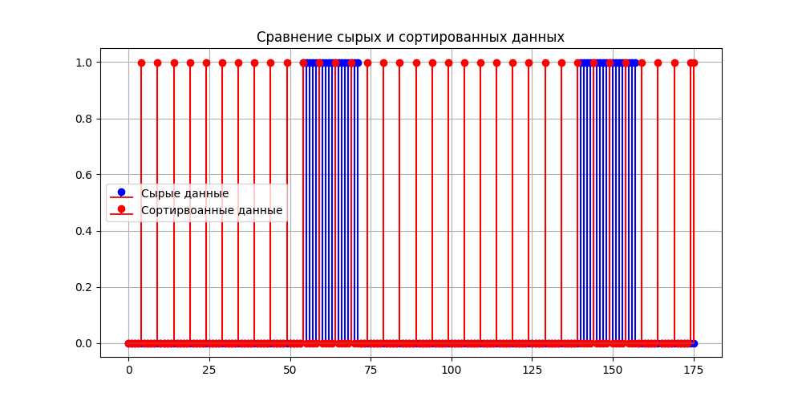
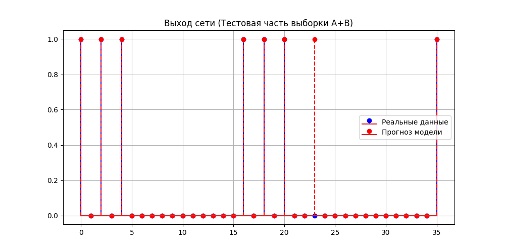
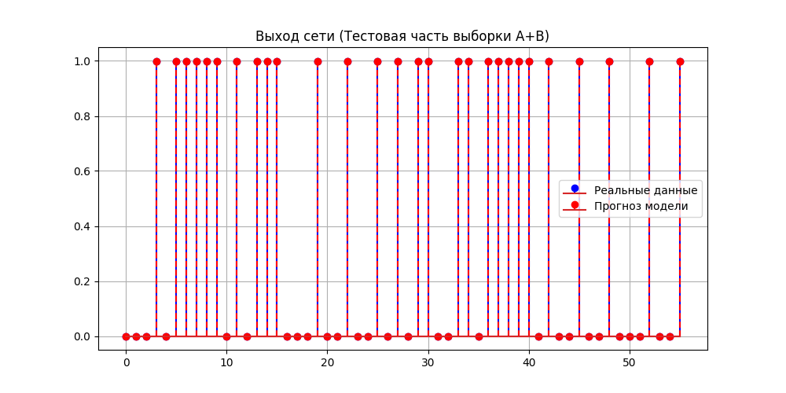
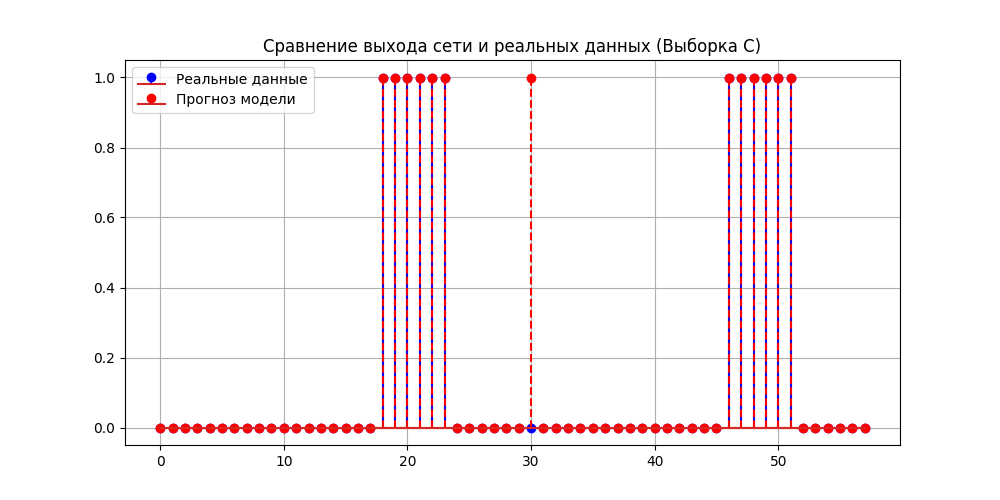

# Лабораторная работа №3: Нейросетевой классификатор типа поверхности для мобильного робота

## Оглавление

1. Цель работы
2. Описание набора данных
3. Предварительная обработка данных
4. Архитектура нейросети и подход к оптимизации
5. Экспериментальная часть
    - Обучение на сырых данных
    - Обучение на нормализованных данных
    - Обучение на сбалансированных данных (SMOTE)
6. Тестирование на контрольной выборке C
7. Результаты и выводы
8. Используемые библиотеки
9. Запуск проекта

---

## Цель работы

Приобретение практических навыков построения нейросетевого классификатора для идентификации типа подстилающей поверхности при движении мобильного робота. Исследование влияния гиперпараметров полносвязной нейронной сети (MLP), предобработки данных (нормализация, балансировка классов) на качество модели. Оценка качества на независимой контрольной выборке.

## Описание набора данных

Исходные данные предоставлены в Excel-файлах:

- `Data_Set_(A+B).xlsx` – обучающая и валидационная выборка (176 образцов)
- `Data_Set_C.xlsx` – тестовая выборка (58 образцов)
- `Data_Set_D.xlsx` – контрольная выборка заказчика

Каждый образец содержит:

- **Показания датчиков** (`V1`): токи двигателей `I1,I2,I3`, угловые скорости `gx,gy,gz`, ускорения `ax,ay,az`, обороты колёс `N1,N2,N3`.
- **Реальные скорости двигателей** `V1real,V2real,V3real` (в работе не использовались).
- **Целевая метка** `Type`: в исходных данных 5 классов (типы поверхностей 1-5).  
    Для задачи бинарной классификации выбран **класс 4** (преобразован в 1, остальные в 0).

На основе исходных переменных рассчитаны производные признаки множеств **V2** и **V3** согласно кинематической модели робота (см. методичку):

- **V2**: линейные скорости робота `vx, vy`, угловая скорость `v_omega`, токовые эквиваленты `curr_x, curr_y, curr_total`.
- **V3**: относительные параметры
$$T_x = \frac{v_x}{curr_x}$$
$$T_{total} = \frac{v_{omega}}{curr_{total}}$$
$$T_{z} = \frac{g_{z}}{curr_{total}}$$

> [!IMPORTANT]  
> В соответствии с вариантом №19 для обучения использовались **только признаки множеств V1 и V3**.  
> Целевая переменная – **бинарный признак "поверхность типа 4"**.

## Предварительная обработка данных

1. **Расчёт кинематических признаков** с помощью класса `RobotKinematicsProcessor`.
    Параметры робота: радиус колеса `R = 0.04 м`, расстояние до колёс `L = 0.125 м`, угол установки колёс `θ = 30°`.
2. **Формирование итогового набора признаков**: `V1_name` (12 переменных) + `V3_name` (4 переменные) → 16 входных признаков.
3. **Масштабирование** данных в диапазон `[0,1]` с помощью `MinMaxScaler` (применялось в соответствующих экспериментах).
4. **Балансировка классов** методом **SMOTE** (только для финальной модели).

> [!NOTE]
> Для анализа распределения признаков и выявления выбросов использовался `ydata-profiling` (результаты сохранены в HTML-отчётах).

## Архитектура нейросети и подход к оптимизации

Использовался многослойный перцептрон `MLPClassifier` из библиотеки `scikit-learn`.

**Варьируемые гиперпараметры:**

- Количество скрытых слоёв (1–3)
- Число нейронов в каждом слое (3–100)
- Функция активации (`logistic`, `tanh`, `relu`)
- Алгоритм обучения (`lbfgs`, `sgd`, `adam`) (в 2 последних экспериментах использован `lbfgs` ввиду лучшего обучения с ним)
- Максимальное число итераций (500–2000)

**Метрики качества:**

- Среднее значение **F1-score** по 5-фолдовой кросс-валидации (максимизация)
- Стандартное отклонение F1-score по фолдам (минимизация для устойчивости моделей)

Для автоматического подбора гиперпараметров применялся фреймворк **Optuna** с многокритериальной оптимизацией гиперпараметров с отображением на (Pareto front).  
Лучшие конфигурации сохранялись в файлы `.pkl` для воспроизводимости.

## Экспериментальная часть

### 1. Обучение на сырых данных

Без нормализации и балансировки.
Оптимизация проводилась с широким диапазоном `solver` (включая `adam`, `lbfgs`).

**Лучшая конфигурация:**

- hidden_layer_sizes = (81, 55, 28)
- activation = 'logistic'
- solver = 'adam'
- max_iter = 855

**Результат на обучающей выборке (A+B):**  
`F1 = 1.0000`



> [!WARNING]  
> При использовании необработанных данных наблюдались предупреждения о несходимости `lbfgs` и переполнении при `sgd`, что указывает на необходимость масштабирования признаков.

> [!WARNING]  
> При использовании сортировки данных для распределения целевой метки по всей выборке не удалось повысить устойчивость и среднюю точность, что вызвано тем, что
> кроссвалидация из `scikit-learn` распределяет выборку в эквивалентном соотношении целевой метки.

Ниже приведеды диаграммы для ознакомления с результатами при сортировке данных





`Итоговая точность на тестовой выборке из A+B: 0.9333`

### 2. Обучение на нормализованных данных

Признаки приведены к интервалу `[0,1]` с помощью `MinMaxScaler`.  
В качестве солвера зафиксирован `lbfgs` (наиболее стабильный для малых выборок).

**Лучшая конфигурация:**

- hidden_layer_sizes = (20, 17)
- activation = 'logistic'
- solver = 'lbfgs'
- max_iter = 1800

**Результат на обучающей выборке:**  
`F1 = 1.0000`


> [!TIP]  
> Нормализация существенно ускорила сходимость и позволила уменьшить размер сети без потери точности.

### 3. Обучение на сбалансированных данных (SMOTE)

После нормализации применён алгоритм **SMOTE** для генерации синтетических примеров миноритарного класса (тип 4).  
Количество образцов в каждом классе стало одинаковым.

**Лучшая конфигурация:**

- hidden_layer_sizes = (7, 63)
- activation = 'relu'
- solver = 'lbfgs'
- max_iter = 1800

**Результат на обучающей выборке:**  
`F1 = 1.0000`



> [!IMPORTANT]  
> Балансировка практически не повлияла на результат оптимизации архитектуры модели, увеличение кол-ва целевых меток позволило улучшить показатели метрики F1 на кроссвалдиации и устойчивость модели в целом.

## Тестирование на тестовой выборке C

Финальная модель (обученная на сбалансированных нормализованных данных) протестирована на независимой выборке `Data_Set_C.xlsx`.  
Предварительно к тестовым данным применён тот же `scaler`, что и при обучении (без повторного `fit`).

**Результат на выборке C:**  
`F1 = 0.9600`



Модель продемонстрировала высокую точность на всех образцах контрольной выборки.

## Используемые библиотеки

- `pandas`, `numpy` – работа с данными
- `scikit-learn` – MLPClassifier, кросс-валидация, метрики, масштабирование
- `imbalanced-learn` – SMOTE для балансировки классов
- `optuna` – автоматический подбор гиперпараметров
- `matplotlib` – визуализация
- `ydata-profiling` – экспресс-анализ данных
- `joblib` – сохранение/загрузка моделей и скейлера
- `pydantic-settings` – продвинутая параметризация проекта через [`config`](core/config.py)

## Запуск проекта

1. Установите зависимости:

```bash
pip install -r requirements.txt
```

2. Поместите файлы данных `Data_Set_(A+B).xlsx` и `Data_Set_C.xlsx` в папку `data/raw/`.
3. Запустите Jupyter Notebook `lab_2.ipynb` и выполните ячейки последовательно.